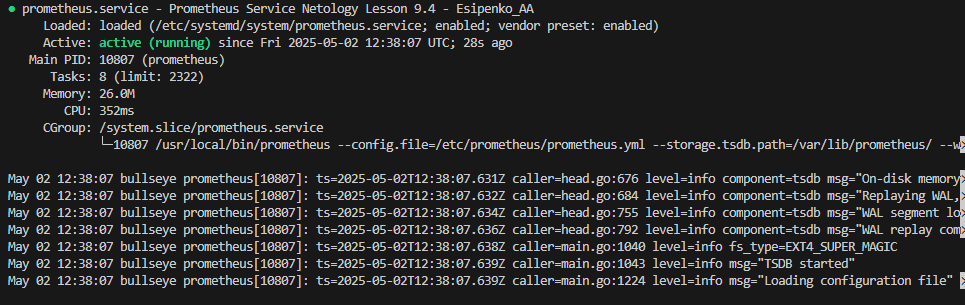
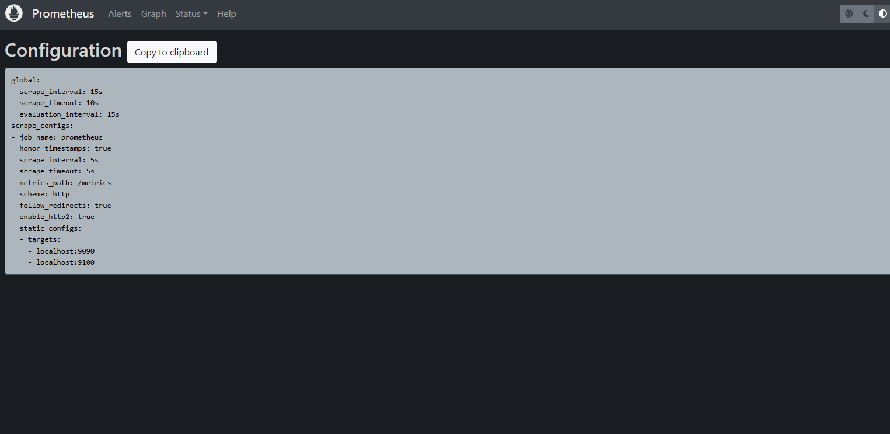

# Домашнее задание №4

## Мониторинг и алертинг

### Задание 1: Prometheus

Настройка и запуск системы мониторинга Prometheus.

### Задание 2: Node Exporter

Настройка и подключение Node Exporter для сбора метрик с сервера.

### Задание 3: Конфигурация и проверка работы

Настройка конфигурации и проверка корректной работы системы мониторинга.

---

*Выполнено в рамках курса по мониторингу и управлению IT-инфраструктурой*